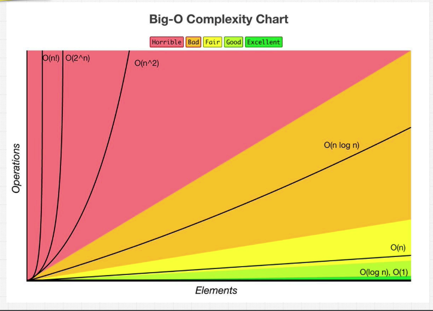

# Algorithm Time-Complexity Analysis （算法时间复杂度分析）

**Goal:** Understand how the runtime of an algorithm is affected by an increasing number of elements.
**目标：** 了解参数的递增如何影响算法的效率

## Big O 的意义

如何清晰的知道一个程序是好的程序还是不好的程序，我们可以通过两个方式：

1. 时间复杂度
2. 空间复杂度

### 时间复杂度

时间复杂度是根据程序运行的时间来判断程序的质量，比如函数 A 和函数 B，用一样的参数返回一样的值，函数 A 用了 10 秒，而函数 B 只用了 1 秒，那我们就能说函数 B 的效率比函数 A 好，但是因为外部环境会造成测试的结果不同，所以单单鱼秒数来判断是不足以来断定那一个函数的效率比较好，而 Big O 就是一门用来计算函数效率的语言。

## 5 Rules

1. Analyze the worst case performance of the algorithm, i.e. Big O
2. Add steps in order (+); multiply nested steps (\*)
3. Different inputs should have different variables, e.g. O(a+b)
4. Remove constants
5. Drop non-dominants

## 3 Types

### 1. Big O – Worst Case

#### Ideal

O(1) – Constant  
O(log n) – Logarithmic  
O(n) – Linear

#### Acceptable

O(n \* log n) – Log Linear

#### Avoid

O(n^2) – Quadratic  
O(2^n) – Exponential  
O(n!) – Factorial

### 2. Big Θ – Average/Tight Case

### 3. Big Ω – Best Case

## Resources

- [Big-O Algorithm Complexity Cheat Sheet (Know Thy Complexities!) @ericdrowell](https://www.bigocheatsheet.com/ "Big O Cheat Sheet")
- [Practical Java Examples of the Big O Notation](https://www.baeldung.com/java-algorithm-complexity "Big O Examples")
